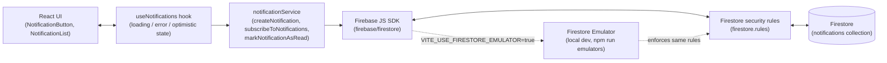

# SignalFlow Notifications

A small, emulator-first demo of realtime user notifications built on React, Vite, TypeScript, and
Firestore. It exists to show the pattern end to end - a Firestore subscription driving React
state, an optimistic read update with rollback, and loading/error handling - rather than to be a
product in its own right.

## What it demonstrates

- **Realtime Firestore subscription** - the notification list is never fetched once; it's a live
  `onSnapshot` listener mapped straight into React state.
- **Optimistic updates** - marking a notification as read flips it in the UI immediately and rolls
  back automatically if the Firestore write fails.
- **Loading and error states** - both the subscription and each write surface failures instead of
  failing silently.
- **Emulator-first development** - the app is built to run against the Firestore emulator by
  default, with security rules that are exercised the same way locally as in production.

## Architecture



Every Firestore read and write is isolated in `src/services/notificationService.ts` - no
component ever imports `firebase/firestore` directly. Documents read off a snapshot are validated
against a zod schema before they become application state, so a malformed or unexpected document
shape is dropped instead of crashing the UI.

### Project structure

```text
src/
  components/     NotificationButton, NotificationList - presentation only
  hooks/          useNotifications - realtime state, loading/error, optimistic updates
  services/       notificationService - the only module that talks to Firestore
  types/          NotificationRecord / NotificationType shared shape
  config/         Firebase app + Firestore initialization, emulator wiring
firestore.rules   Security rules for the notifications collection
firebase.json     Emulator ports and Firestore config
```

## Getting started

Requires Node 24.x and npm 11.x (see `.nvmrc` / `engines` in `package.json`).

```bash
npm install
cp .env.example .env
```

`.env.example` only ever contains placeholder values - see
[Environment variables](#environment-variables) below for what each one means and where emulator
vs. real-project config differs.

### Run against the Firestore emulator (recommended for local dev)

The emulator needs the Firebase CLI and a JRE (the emulator runs on Java); install
[Firebase CLI](https://firebase.google.com/docs/cli) globally if you don't already have it:

```bash
npm install -g firebase-tools
```

Then, in one terminal:

```bash
npm run emulators
```

This starts the Firestore emulator on `127.0.0.1:8080` (Emulator UI on `127.0.0.1:4000`) using
`firebase.json`, and enforces the exact same rules in `firestore.rules` that production does. In a
second terminal:

```bash
npm run dev
```

With `VITE_USE_FIRESTORE_EMULATOR=true` (the default in `.env.example`), the app connects to the
local emulator instead of a real Firebase project - `VITE_FIREBASE_PROJECT_ID` can stay as the
placeholder value in that mode, since the emulator doesn't check it against a real project.

### Run against a real Firebase project

1. Create a Firestore-enabled project in the
   [Firebase console](https://console.firebase.google.com/).
2. Copy its web app config into `.env` (`VITE_FIREBASE_*` values) and update `.firebaserc`'s
   `default` project id.
3. Set `VITE_USE_FIRESTORE_EMULATOR=false`.
4. Deploy the rules in this repo so production enforces the same constraints as the emulator:

   ```bash
   firebase deploy --only firestore:rules
   ```

## Environment variables

| Variable                            | Purpose                                                        |
| ----------------------------------- | -------------------------------------------------------------- |
| `VITE_FIREBASE_API_KEY`             | Firebase web app API key                                       |
| `VITE_FIREBASE_AUTH_DOMAIN`         | Firebase auth domain                                           |
| `VITE_FIREBASE_PROJECT_ID`          | Firebase project id (any placeholder works under the emulator) |
| `VITE_FIREBASE_STORAGE_BUCKET`      | Firebase storage bucket                                        |
| `VITE_FIREBASE_MESSAGING_SENDER_ID` | Firebase messaging sender id                                   |
| `VITE_FIREBASE_APP_ID`              | Firebase app id                                                |
| `VITE_USE_FIRESTORE_EMULATOR`       | `"true"` to connect to the local emulator instead of Firebase  |

None of these are secret in the sense of granting write access on their own - Firestore access
control lives entirely in `firestore.rules`, not in the client config. Still, never commit a real
`.env` file; only `.env.example` (placeholders only) is tracked, and `.gitignore` blocks every
other `.env*` variant.

## Firestore security rules

`firestore.rules` scopes the `notifications` collection to exactly what this app does:

- **Read**: open (this demo has no auth layer).
- **Create**: only documents with the exact fields the app writes
  (`type`/`message`/`read`/`createdAt`), `type` restricted to `info | alert | message`, a
  non-empty bounded `message`, `read` starting `false`, and `createdAt` required to equal the
  request's server timestamp (so a client can't backdate or forge it).
- **Update**: only the `read` field may change, and only `false -> true`.
- **Delete**: denied entirely.

Because the emulator loads this same file, running `npm run emulators` locally exercises the real
rules, not a permissive stand-in.

## Scripts

| Command                           | Purpose                                                      |
| --------------------------------- | ------------------------------------------------------------ |
| `npm run dev`                     | Start the Vite dev server.                                   |
| `npm run build`                   | Production build (output in `dist/`).                        |
| `npm run preview`                 | Preview the production build locally.                        |
| `npm run emulators`               | Start the Firebase emulator suite (Firestore + Emulator UI). |
| `npm run quality`                 | Format check, lint, and typecheck.                           |
| `npm run lint`                    | ESLint (zero warnings allowed).                              |
| `npm run format` / `format:check` | Prettier write / check.                                      |
| `npm run typecheck`               | `tsc --noEmit`.                                              |
| `npm test`                        | Vitest with coverage.                                        |
| `npm run security:audit`          | `npm audit --audit-level=high`.                              |

## Quality gates

This repo follows the Webvoltz React engineering standards: strict TypeScript (no `any`, the full
`strict` family of compiler flags), a flat ESLint config with type-aware rules plus React/hooks/
a11y plugins, Prettier, and exact pinned dependency versions. A Husky pre-commit hook runs Gitleaks
secret scanning, `lint-staged`, the full `quality` check, and a production build before any commit
is allowed through; `commit-msg` enforces Conventional Commits via commitlint.

`skipLibCheck` is enabled (a deliberate deviation from the strict template) because some current
third-party packages ship `.d.ts` files that conflict with the TypeScript version
`typescript-eslint` supports. It only skips checking third-party type declarations - this
project's own source is still fully type-checked.

## Testing

`npm test` runs the full suite with coverage thresholds enforced (see `vite.config.ts`):

- `src/services/notificationService.test.ts` - the exact Firestore write payload, realtime
  snapshot-to-record mapping (including a pending server timestamp and a malformed document that
  must be dropped rather than crash the subscription), and that write failures propagate to the
  caller instead of being swallowed.
- `src/hooks/useNotifications.test.ts` - the optimistic read update and its rollback on failure,
  plus loading/error state for both the subscription and notification creation.
- Component tests for `NotificationList` and `NotificationButton`.

## License

MIT - see [LICENSE](LICENSE).
