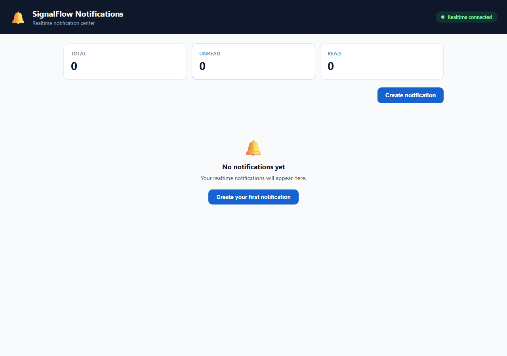
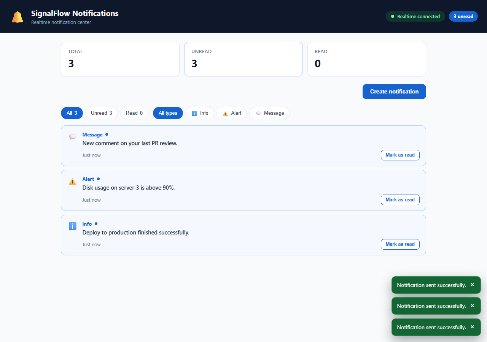
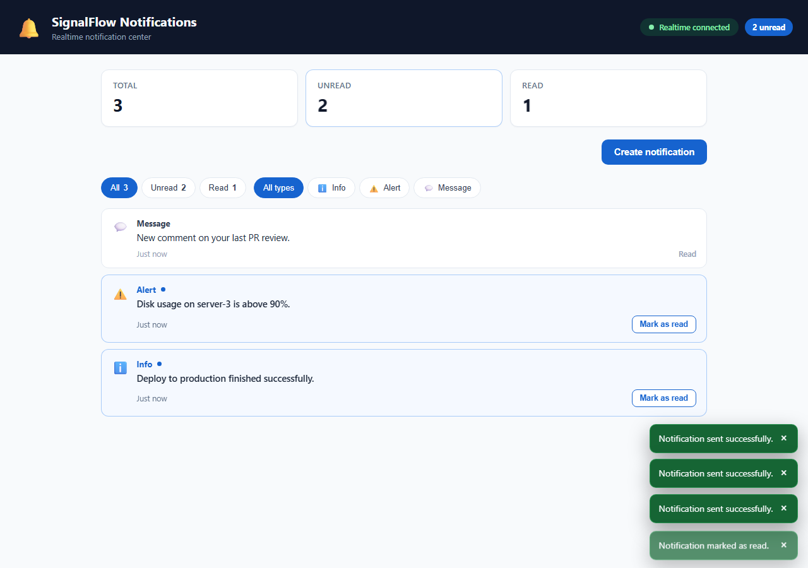
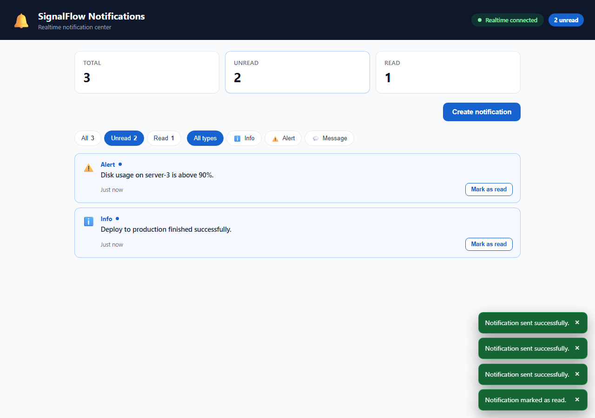
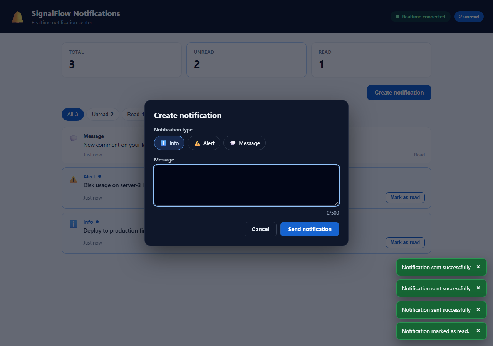
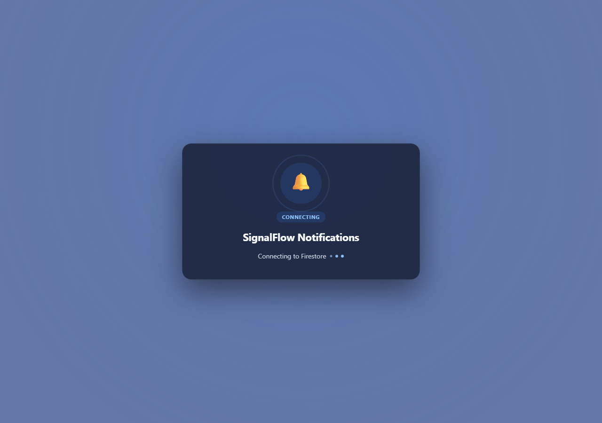
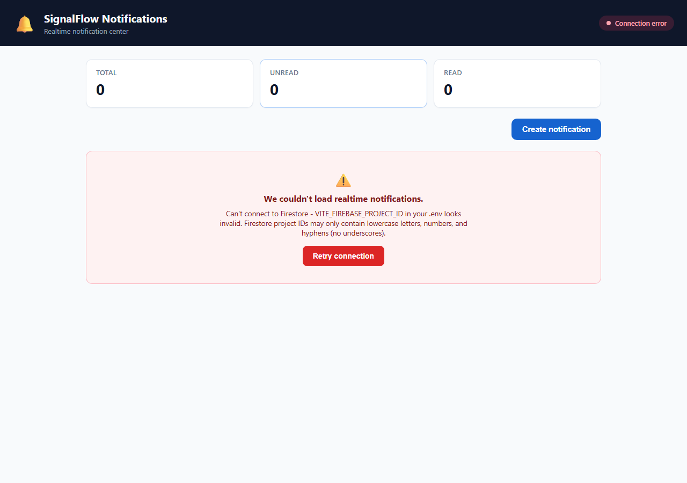
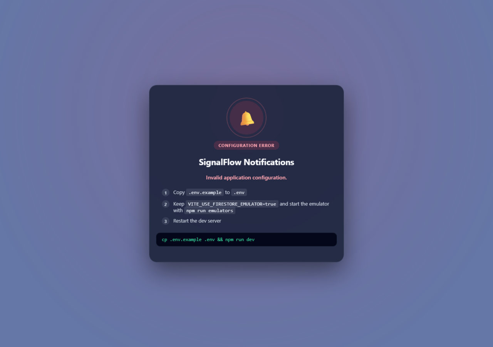
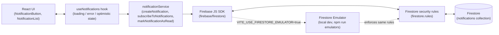

# 🔔 SignalFlow Notifications

A small, emulator-first demo of realtime user notifications built on React, Vite, TypeScript, and
Firestore. It exists to show the pattern end to end - a Firestore subscription driving React
state, an optimistic read update with rollback, and loading/error handling - rather than to be a
product in its own right.

## ✨ Features

- **Realtime notification dashboard** - a header with a live connection indicator and unread
  badge, total/unread/read summary cards, status/type filters, and a card list - not a bare table.
- **Realtime Firestore subscription** - the notification list is never fetched once; it's a live
  `onSnapshot` listener mapped straight into React state, gated on server confirmation (not just a
  local cache echo) before the app ever reports itself as connected.
- **Optimistic updates with rollback** - marking a notification as read flips it in the UI
  immediately and rolls back automatically if the Firestore write fails.
- **A real creation flow** - a modal with type selection, a validated message field (required,
  no whitespace-only, 500-character limit, live counter), and submit states that never lose the
  user's typed message on failure.
- **Toasts, not silent failures** - success/error feedback for every write, with plain-language
  copy - never a raw Firebase error object.
- **Connection recovery** - a persistent panel with a Retry action when the realtime subscription
  itself fails, independent of the toasts used for individual write failures.
- **Runtime validation** - every Firestore document, every outgoing write, and every `VITE_`
  environment variable is parsed through a zod schema before the app trusts it.
- **Emulator-first development** - the app runs against the Firestore emulator by default, with
  security rules exercised the same way locally as in production.
- **Firestore security rules** - writes are constrained to the exact document shape the app
  produces; nothing else is accepted.
- **Accessible by default** - a focus-trapped, Escape-closable modal, `aria-live` toasts, semantic
  status/alert roles, visible focus states, and type always shown as an icon **and** a text label
  (never color alone).
- **Strict TypeScript** - no `any` anywhere, full `strict` compiler family, zero-warning ESLint.
- Animations respect `prefers-reduced-motion` throughout.

## 📸 Screenshots

All captured from the app running locally against the Firestore emulator (`npm run dev` +
`npm run emulators`) at the default responsive breakpoint.

### Functionality

|                                                                                             |                                                                                                    |
| ------------------------------------------------------------------------------------------- | -------------------------------------------------------------------------------------------------- |
|                           |               |
| Empty state - no notifications yet, with a "Create your first notification" call to action. | Three unread notifications across all types, with a success toast stacked for each realtime write. |

|                                                                                        |                                                                     |
| -------------------------------------------------------------------------------------- | ------------------------------------------------------------------- |
|                             |       |
| Optimistic mark-as-read - the card updates instantly, with its own confirmation toast. | The status filter narrowed to "Unread", hiding the read card above. |

|                                                                                                        |                                                                                          |
| ------------------------------------------------------------------------------------------------------ | ---------------------------------------------------------------------------------------- |
|                              |  |
| The create-notification modal on open - no validation error until the user actually interacts with it. | Submitting with an empty message - inline validation, no silent failure.                 |

### Error and recovery states

|                                                                                                           |                                                                                                                                                  |
| --------------------------------------------------------------------------------------------------------- | ------------------------------------------------------------------------------------------------------------------------------------------------ |
|                                                  |                                                                                     |
| The animated splash shown while waiting for the Firestore subscription's first server-confirmed snapshot. | `ConnectionErrorPanel` after a real subscription failure (invalid `VITE_FIREBASE_PROJECT_ID`), with a plain-language message and a Retry action. |



The full-page `ConfigErrorScreen` shown when `.env` is missing or fails zod validation in
`src/config/env.ts` - before React ever mounts the real app, with the exact fix inline.

## 🧰 Tech stack

| Technology                                    | Role                                               |
| --------------------------------------------- | -------------------------------------------------- |
| React 19                                      | UI                                                 |
| TypeScript (strict)                           | Type safety                                        |
| Vite                                          | Dev server and production build                    |
| Firebase JS SDK / Firestore                   | Realtime database and client SDK                   |
| Zod                                           | Runtime validation (Firestore documents, env vars) |
| Vitest + Testing Library                      | Unit and component tests                           |
| ESLint, Prettier, Husky, commitlint, Gitleaks | Code quality and security gates                    |

## 🏗️ Architecture



Every Firestore read and write is isolated in `src/services/notificationService.ts` - no
component ever imports `firebase/firestore` directly. Documents read off a snapshot are validated
against a zod schema before they become application state, so a malformed or unexpected document
shape is dropped instead of crashing the UI.

## 📁 Project structure

```text
src/
  components/     AppHeader, SummaryCards, NotificationList/Card, CreateNotificationModal,
                  ToastViewport, EmptyState, ConnectionErrorPanel, LoadingScreen,
                  ConfigErrorScreen, ErrorBoundary - all presentation only
  hooks/          useNotifications (realtime state, connection status, optimistic updates),
                  useToasts (feedback queue)
  services/       notificationService - the only module that talks to Firestore
  types/          NotificationRecord / NotificationType shared shape
  utils/          formatRelativeTime, notificationTypeMeta, humanizeFirestoreError
  config/         Firebase app + Firestore initialization, env validation, emulator wiring
firestore.rules   Security rules for the notifications collection
firebase.json     Emulator ports and Firestore config
```

## 🔄 Data flow

**Creating a notification:**

```text
NotificationButton (onSend)
  -> App.handleSend
  -> useNotifications.sendNotification
  -> notificationService.createNotification
  -> Firebase SDK: addDoc(..., createdAt: serverTimestamp())
  -> Firestore write, checked against firestore.rules
```

**Receiving it back, in realtime, on every connected client:**

```text
Firestore document change
  -> onSnapshot fires
  -> notificationService.subscribeToNotifications maps + zod-validates each document
  -> useNotifications updates notifications / loading / error state
  -> NotificationList re-renders
```

Marking a notification as read updates local state immediately (optimistic), then confirms with a
Firestore write; a failed write rolls the local state back and surfaces the error.

## 🔑 Environment variables

| Variable                            | Purpose                                                        |
| ----------------------------------- | -------------------------------------------------------------- |
| `VITE_FIREBASE_API_KEY`             | Firebase web app API key                                       |
| `VITE_FIREBASE_AUTH_DOMAIN`         | Firebase auth domain                                           |
| `VITE_FIREBASE_PROJECT_ID`          | Firebase project id (any placeholder works under the emulator) |
| `VITE_FIREBASE_STORAGE_BUCKET`      | Firebase storage bucket                                        |
| `VITE_FIREBASE_MESSAGING_SENDER_ID` | Firebase messaging sender id                                   |
| `VITE_FIREBASE_APP_ID`              | Firebase app id                                                |
| `VITE_USE_FIRESTORE_EMULATOR`       | `"true"` to connect to the local emulator instead of Firebase  |

`.env.example` contains placeholders for all of these - copy it to `.env` and fill in real values
only if you're pointing at an actual Firebase project (see [Local development](#local-development)
below). `src/config/env.ts` validates every one of them at startup via zod and throws a single
generic error if any is missing or malformed, so a bad value never leaks into a raw SDK error.
None of these are secret in the sense of granting write access on their own - Firestore access
control lives entirely in `firestore.rules`, not in the client config. Still, never commit a real
`.env` file; `.gitignore` blocks every `.env*` variant except `.env.example`.

## 🛡️ Firestore security rules

`firestore.rules` scopes the `notifications` collection to exactly what this app does:

- **Read**: open (this demo has no auth layer).
- **Create**: only documents with the exact fields the app writes
  (`type`/`message`/`read`/`createdAt`), `type` restricted to `info | alert | message`, a
  non-empty bounded `message`, `read` starting `false`, and `createdAt` required to equal the
  request's server timestamp (so a client can't backdate or forge it).
- **Update**: only the `read` field may change, and only `false -> true`.
- **Delete**: denied entirely.

Because the emulator loads this same file, running `npm run emulators` locally exercises the real
rules, not a permissive stand-in.

## 💻 Local development

Requires Node 24.x and npm 11.x (see `.nvmrc` / `engines` in `package.json`).

```bash
npm ci
cp .env.example .env
```

### 🖥️ Run against the Firestore emulator (recommended)

The emulator needs the Firebase CLI and a JRE (the emulator runs on Java); install
[Firebase CLI](https://firebase.google.com/docs/cli) globally if you don't already have it:

```bash
npm install -g firebase-tools
```

Then, in one terminal:

```bash
npm run emulators
```

This starts the Firestore emulator on `127.0.0.1:8080` (Emulator UI on `127.0.0.1:4000`). In a
second terminal:

```bash
npm run dev
```

With `VITE_USE_FIRESTORE_EMULATOR=true` (the default in `.env.example`), the app connects to the
local emulator instead of a real Firebase project - `VITE_FIREBASE_PROJECT_ID` can stay as the
placeholder value in that mode.

### ☁️ Run against a real Firebase project

The emulator mode above needs no real account - `VITE_FIREBASE_*` can stay as placeholders. Only
follow these steps if you actually want this app talking to a real Firebase project.

1. 🆕 **Create a project** - go to the [Firebase console](https://console.firebase.google.com/),
   click **Add project**, and follow the prompts (Google Analytics is optional, and not used by
   this app).
2. 🗄️ **Turn on Firestore** - in the left sidebar, **Build → Firestore Database → Create
   database**. Pick any location; choose either mode, since `firestore.rules` (deployed in step 6)
   is what actually enforces access either way.
3. 📱 **Register a web app** - click the gear icon next to **Project Overview → Project settings**,
   scroll to **Your apps**, click the **</>** (web) icon, give it any nickname, and click
   **Register app**. You can leave Firebase Hosting unchecked.
4. 📋 **Copy the config values shown** - Firebase displays a `firebaseConfig` object right after
   registering (you can always get back to it later from **Project settings → Your apps → SDK
   setup and configuration**):

   ```js
   const firebaseConfig = {
     apiKey: '...',
     authDomain: '...',
     projectId: '...',
     storageBucket: '...',
     messagingSenderId: '...',
     appId: '...',
   };
   ```

5. 📝 **Paste each value into `.env`** - one-to-one, matching the property name:

   | `firebaseConfig` property | `.env` variable                     |
   | ------------------------- | ----------------------------------- |
   | `apiKey`                  | `VITE_FIREBASE_API_KEY`             |
   | `authDomain`              | `VITE_FIREBASE_AUTH_DOMAIN`         |
   | `projectId`               | `VITE_FIREBASE_PROJECT_ID`          |
   | `storageBucket`           | `VITE_FIREBASE_STORAGE_BUCKET`      |
   | `messagingSenderId`       | `VITE_FIREBASE_MESSAGING_SENDER_ID` |
   | `appId`                   | `VITE_FIREBASE_APP_ID`              |

6. 🔁 **Switch off the emulator flag** - set `VITE_USE_FIRESTORE_EMULATOR=false` in `.env`.
7. 🛡️ **Deploy the security rules** - update `.firebaserc`'s `default` project id to match, then
   push this repo's rules so production enforces the exact same constraints as the emulator:

   ```bash
   firebase deploy --only firestore:rules
   ```

8. ▶️ **Run it** - `npm run dev`. There's no emulator to start in this mode; the app talks to your
   real Firestore project directly.

## ⚙️ Available commands

| Command                           | Purpose                                                      |
| --------------------------------- | ------------------------------------------------------------ |
| `npm run dev`                     | Start the Vite dev server.                                   |
| `npm run build`                   | Production build (output in `dist/`).                        |
| `npm run preview`                 | Preview the production build locally.                        |
| `npm run emulators`               | Start the Firebase emulator suite (Firestore + Emulator UI). |
| `npm run quality`                 | Format check, lint, and typecheck.                           |
| `npm run lint`                    | ESLint (zero warnings allowed).                              |
| `npm run format` / `format:check` | Prettier write / check.                                      |
| `npm run typecheck`               | `tsc --noEmit`.                                              |
| `npm test`                        | Vitest with coverage.                                        |
| `npm run security:audit`          | `npm audit --audit-level=high`.                              |

## 🧪 Testing

`npm test` runs the full suite (97 tests) with coverage thresholds enforced in `vite.config.ts`
(currently 98.9% statements, 95.2% branches, 100% functions, 98.9% lines - above the 90/85/100/90
floor):

- `src/services/notificationService.test.ts` - the exact Firestore write payload (including that
  the outgoing message is validated and trimmed client-side before ever reaching Firestore),
  realtime snapshot-to-record mapping (including a pending server timestamp and a malformed
  document that must be dropped rather than crash the subscription), and that write failures
  propagate to the caller instead of being swallowed.
- `src/hooks/useNotifications.test.ts` - the loading/connection-status gate on server
  confirmation, the optimistic read update and its rollback on failure (including that other
  notifications are left untouched), and `retryConnection`'s re-subscribe behavior.
- `src/hooks/useToasts.test.ts` - stacking, manual dismissal, and auto-dismiss timing.
- `src/utils/formatRelativeTime.test.ts` - every relative-time bucket plus the "Time unavailable"
  fallback for a non-finite timestamp (never "Invalid Date").
- `src/config/env.test.ts` - valid config parses correctly; a missing/invalid value throws one
  generic error that never contains the value supplied.
- `src/components/CreateNotificationModal.test.tsx` - validation timing (never on open), every
  validation message, submit states, duplicate-submission prevention, focus trap (Tab/Shift+Tab
  wrapping), Escape, and that a failed submission preserves the typed message.
- `src/components/ErrorBoundary.test.tsx` - the fallback UI and that "Try again" attempts a fresh
  render.
- `src/App.test.tsx` - end-to-end flows: loading -> connected, connection error -> retry,
  create -> toast, mark-as-read -> toast, and recovery via the error boundary.
- Further component tests for `AppHeader`, `SummaryCards`, `NotificationList`/`NotificationCard`,
  `EmptyState`, `ConnectionErrorPanel`, and `ToastViewport`.

## 🔒 Code quality and security

This repo follows the Webvoltz React engineering standards: strict TypeScript (no `any`, the full
`strict` family of compiler flags), a flat ESLint config with type-aware rules plus React/hooks/
a11y plugins, Prettier, and exact pinned dependency versions. A Husky pre-commit hook runs Gitleaks
secret scanning, `lint-staged`, the full `quality` check, and a production build before any commit
is allowed through; `commit-msg` enforces Conventional Commits via commitlint. The same gates run
in CI (`.github/workflows/ci.yml`) - secret scan and dependency audit first, then quality and
commit-message lint, then tests, then the production build - so a bypassed or missing local hook
still gets caught before anything merges.

`skipLibCheck` is `false`, matching the standard exactly - every third-party `.d.ts` file is
type-checked too, not just this project's own source. That only holds together with the exact
`vite`/`vitest`/`@vitest/coverage-v8` versions pinned in `package.json`: newer vite/vitest pairs
(e.g. vite 8.2.x with vitest 5.x) currently ship mismatched internal type declarations between the
two packages, unrelated to this project's code, that only `skipLibCheck: true` can paper over.

## 🧠 Design decisions

- **Firestore over a REST API** - `onSnapshot` is the whole point of this demo: a live listener
  that pushes changes to every connected client, no polling.
- **Optimistic updates** - a network round-trip for every read-status change would make the UI
  feel laggy for something this small; rollback-on-failure keeps it honest when the write fails.
- **Zod at every boundary** - Firestore documents and `import.meta.env` are both untyped at
  runtime. Validating them with zod avoids unsafe casts and gives a single, predictable failure
  mode (drop the document, or throw one generic config error) instead of letting bad data crash
  the app or leak raw values into an error message.
- **`serverTimestamp()` over a client `Date()`** - avoids client clock skew, and lets
  `firestore.rules` check `createdAt == request.time` so a client can't forge when a notification
  was created.
- **A dedicated service module** - `notificationService.ts` is the only file that imports
  `firebase/firestore`, which is what makes every other layer (the hook, the components) testable
  with plain mocks instead of a real Firestore connection.

## 🐛 Troubleshooting

- **Emulator won't connect** - confirm `VITE_USE_FIRESTORE_EMULATOR=true` in `.env` and that
  `npm run emulators` is actually running (check `127.0.0.1:4000` for the Emulator UI).
- **Blank page, or "Invalid application configuration."** - a missing or malformed `VITE_*`
  value fails validation in `src/config/env.ts`. `main.tsx` catches this and renders a screen with
  the fix; if you see a genuinely blank page instead, you're most likely missing `.env` entirely -
  run `cp .env.example .env` and restart `npm run dev`.
- **Env vars not taking effect** - Vite only reads `.env` at startup; restart `npm run dev` after
  editing it.
- **Firestore "permission denied" on write** - `firestore.rules` only accepts the exact document
  shape `notificationService.ts` sends, and updates may only flip `read` from `false` to `true`;
  anything else (including deletes) is denied by design.
- **Type errors after changing `vite`/`vitest`/`@vitest/coverage-v8` versions** - these three are
  pinned deliberately (see [Code quality and security](#code-quality-and-security)); an unpinned
  upgrade can reintroduce upstream `.d.ts` conflicts that `skipLibCheck: false` would otherwise
  catch.

## 🚀 Future improvements

- Firebase Authentication, scoping notifications per user instead of one shared collection.
- Pagination/windowing once a notification list can grow unbounded.
- Notification categories or filtering in the UI.
- Push notifications (FCM) alongside the in-app realtime feed.

## 📄 License

MIT - see [LICENSE](LICENSE).
